<div dir="rtl">

# دکمه شناور تماس (Floating Call Button)

افزونه وردپرسی برای افزودن یک **دکمه شناور** به همه صفحات یا صفحات دلخواه سایت. با کلیک روی دکمه، منویی از **کانال‌های ارتباطی** (تماس تلفنی، واتساپ، تلگرام، اینستاگرام، ایمیل، پیامک، ایتا، بله، روبیکا، لینک دلخواه و ...) باز می‌شود.

طراحی شده توسط [مهدی حبیبی | طاووس وب](https://tavoosweb.ir/)

<p align="center">
  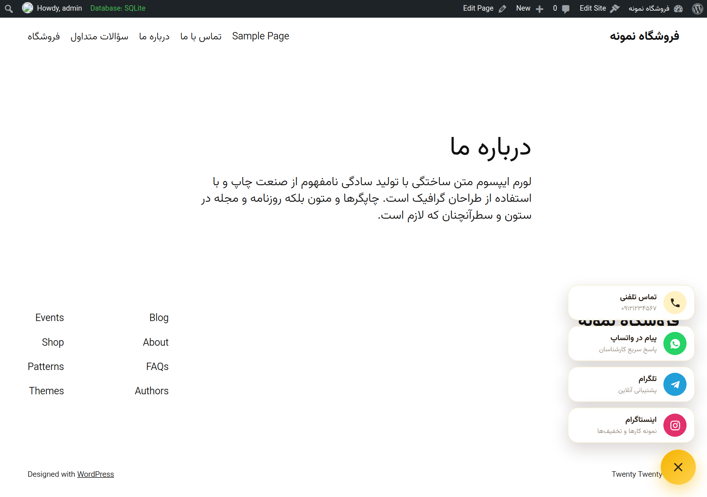
  &nbsp;
  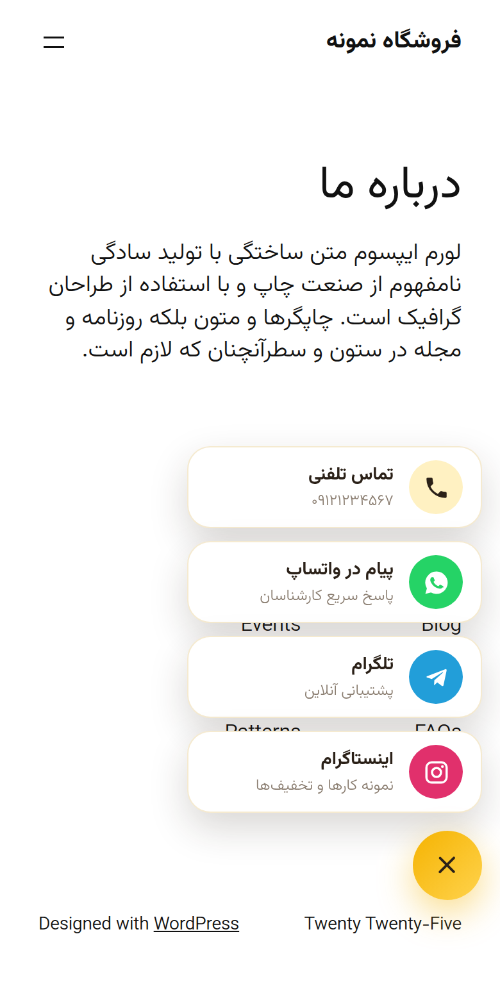
</p>

## امکانات

- نمایش در **همه صفحات**، **فقط صفحات انتخاب‌شده** یا **همه به جز صفحات انتخاب‌شده** (برگه‌ها، صفحه اصلی، نوشته‌ها، محصولات ووکامرس با شناسه)
- **۸ موقعیت آماده** (پایین راست، پایین چپ، پایین وسط، وسط راست، وسط چپ، بالا راست، بالا چپ، بالا وسط) و **موقعیت دلخواه درصدی** (W/H) با کلیک یا کشیدن روی صفحه نمونه
- فاصله از لبه و اندازه دکمه جداگانه برای **دسکتاپ و موبایل**
- **آیکون دکمه قابل تغییر**: ۱۶ آیکون آماده، کد SVG دلخواه یا آپلود تصویر از کتابخانه رسانه
- **رنگ دکمه قابل تغییر**: رنگ ثابت یا گرادیان دو رنگ، رنگ آیکون و رنگ‌های منو
- **کانال‌های ارتباطی نامحدود**: افزودن، حذف، غیرفعال کردن و **جابجایی با کشیدن**؛ هر کانال با عنوان، زیرعنوان، آیکون و رنگ مخصوص خودش
- ساخت خودکار لینک هر کانال (مثلاً `wa.me` برای واتساپ، `t.me` برای تلگرام، `tel:` برای تماس) و پشتیبانی از **ارقام فارسی**
- متن پیش‌فرض پیام برای واتساپ و پیامک، و موضوع پیش‌فرض برای ایمیل
- پیش‌نمایش زنده در پیشخوان
- حالت «یک کانال»: اگر فقط یک کانال فعال باشد، دکمه مستقیم به همان لینک می‌رود
- راست‌چین/چپ‌چین خودکار، دسترسی‌پذیر (ARIA، بستن با Esc)، سبک و بدون jQuery در سایت؛ فایل‌ها فقط در صفحاتی که دکمه نمایش داده می‌شود بارگذاری می‌شوند

## نصب

1. پوشه افزونه را (یا فایل zip آن را) در مسیر `wp-content/plugins/` قرار دهید، یا از **افزونه‌ها ← افزودن ← بارگذاری افزونه** فایل zip را آپلود کنید.
2. از منوی **افزونه‌ها**، افزونه «دکمه شناور تماس» را فعال کنید.
3. منوی جدید **دکمه تماس** در پیشخوان اضافه می‌شود.

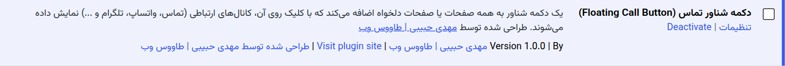

---

## آموزش تصویری

### ۱. کانال‌های ارتباطی

در تب **کانال‌های ارتباطی**، کانال‌های پیش‌فرض (تماس تلفنی، واتساپ و تلگرام) را می‌بینید. روی هر کانال کلیک کنید تا تنظیماتش باز شود:

- **نوع کانال**: با تغییر نوع، آیکون، رنگ و راهنمای فیلد به‌صورت خودکار تنظیم می‌شود.
- **شماره / نام کاربری / لینک**: فقط مقدار را وارد کنید، افزونه لینک را می‌سازد (لینک کامل هم قبول می‌شود).
- **عنوان** و **زیرعنوان**: متن‌هایی که در منو نمایش داده می‌شوند.
- **متن پیش‌فرض پیام**: برای واتساپ و پیامک (برای ایمیل: موضوع).
- سوئیچ **فعال** برای نمایش یا مخفی کردن موقت کانال، آیکون <kbd>☰</kbd> برای جابجایی و آیکون سطل زباله برای حذف.

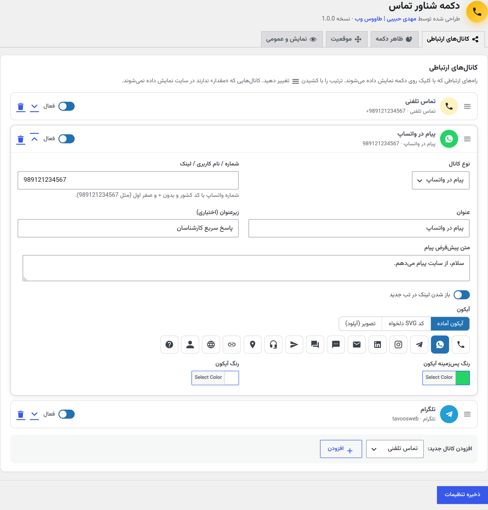

> کانال‌هایی که مقدار ندارند در سایت نمایش داده نمی‌شوند.

### ۲. افزودن کانال جدید

پایین لیست، نوع کانال را انتخاب کنید و روی **افزودن** بزنید:

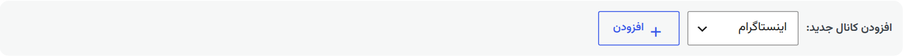

کانال جدید با مقادیر پیش‌فرض همان نوع ساخته می‌شود و می‌توانید همه‌چیز را تغییر دهید:

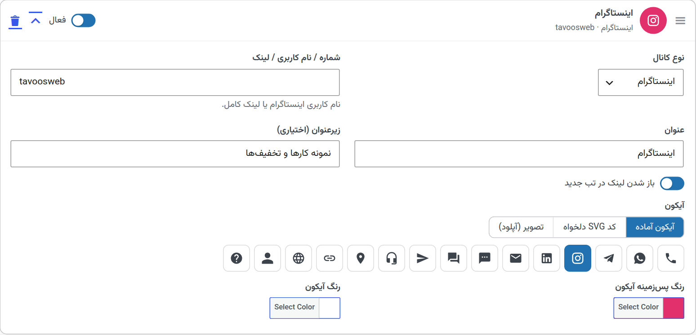

برای کانالی که در لیست نیست (مثلاً یک شبکه اجتماعی دیگر)، نوع **لینک دلخواه** را انتخاب کنید و آیکون آن را خودتان بگذارید.

#### آیکون دلخواه

برای هر کانال (و دکمه اصلی) سه روش انتخاب آیکون وجود دارد:

| روش | توضیح |
|---|---|
| آیکون آماده | انتخاب از ۱۶ آیکون |
| کد SVG دلخواه | کد SVG را بچسبانید؛ کدهای خطرناک (اسکریپت و رویدادها) خودکار حذف می‌شوند. با `fill="currentColor"` آیکون هم‌رنگ «رنگ آیکون» می‌شود. |
| تصویر (آپلود) | انتخاب از کتابخانه رسانه یا وارد کردن آدرس تصویر (PNG/SVG/WebP) |

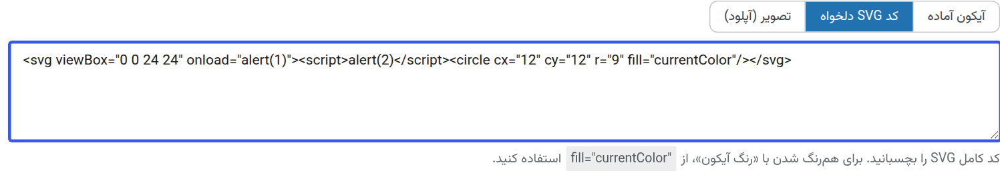

### ۳. ظاهر دکمه

در تب **ظاهر دکمه**، آیکون دکمه اصلی، رنگ پس‌زمینه، رنگ دوم (برای گرادیان؛ خالی = رنگ ثابت)، رنگ آیکون، اندازه دکمه در دسکتاپ و موبایل و انیمیشن پالس را تنظیم کنید. پیش‌نمایش سمت چپ همزمان به‌روز می‌شود.

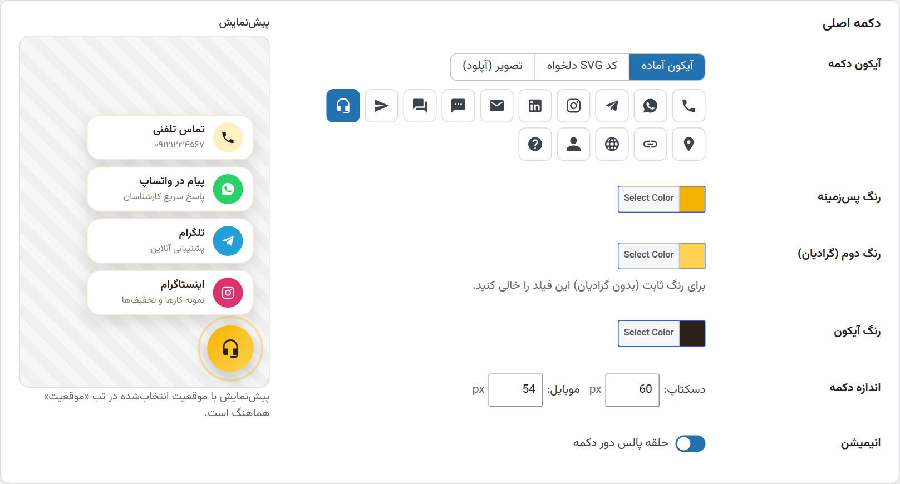

<p align="center">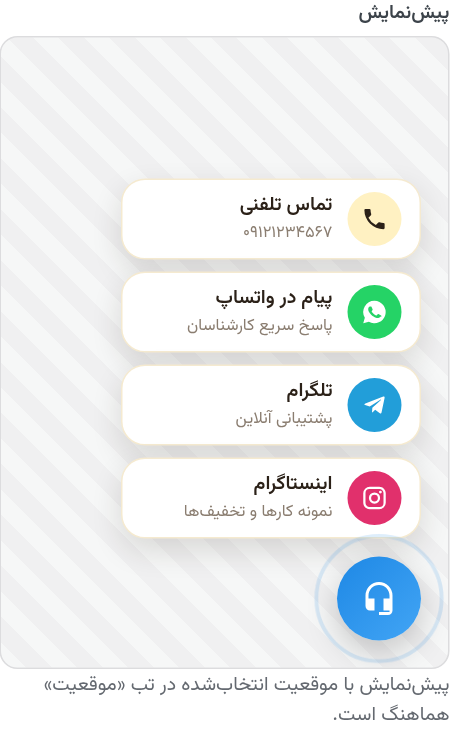</p>

در همین تب، بخش **ظاهر منوی کانال‌ها** هم برای رنگ پس‌زمینه کارت‌ها، عنوان، زیرعنوان و حاشیه وجود دارد.

### ۴. موقعیت دکمه

یکی از موقعیت‌های آماده را انتخاب کنید و فاصله از لبه صفحه را (جداگانه برای دسکتاپ و موبایل) به پیکسل تعیین کنید:

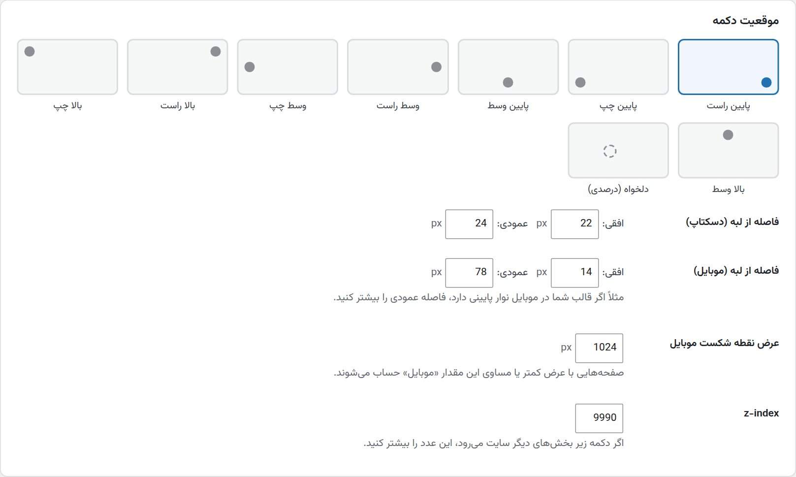

#### موقعیت دلخواه درصدی (W/H)

گزینه **دلخواه (درصدی)** را بزنید، سپس روی صفحه نمونه کلیک کنید یا نقطه را بکشید. می‌توانید مقدارها را دستی هم وارد کنید:

- **افقی (W)**: ۰٪ = لبه چپ، ۱۰۰٪ = لبه راست
- **عمودی (H)**: ۰٪ = بالای صفحه، ۱۰۰٪ = پایین صفحه

دکمه در هر مقداری داخل صفحه باقی می‌ماند و جهت باز شدن منو (بالا، پایین یا کنار دکمه) خودکار انتخاب می‌شود.

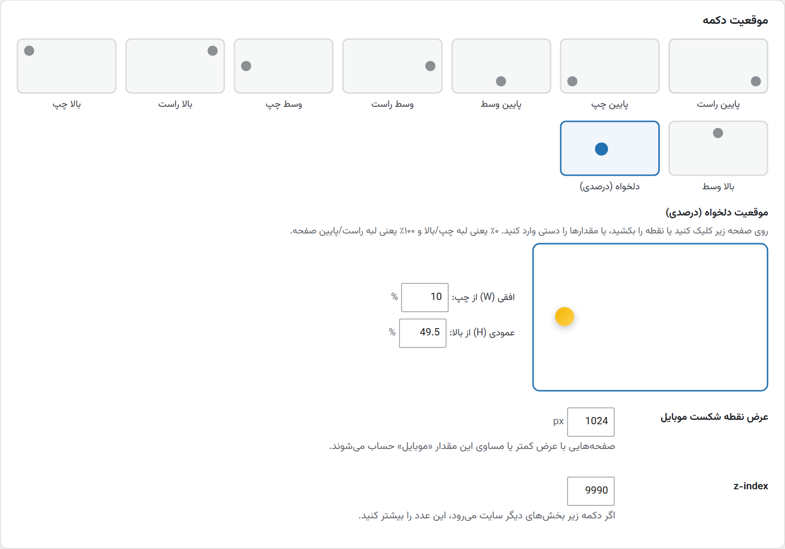

نتیجه در سایت (افقی ۱۵٪، عمودی ۸۰٪ با رنگ آبی):

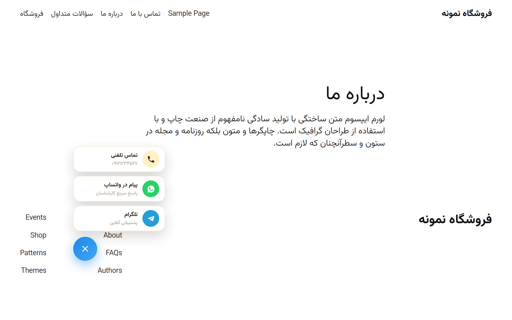

همچنین **عرض نقطه شکست موبایل** (پیش‌فرض ۱۰۲۴ پیکسل) و **z-index** در این تب قابل تنظیم است.

### ۵. نمایش در صفحات و تنظیمات عمومی

در تب **نمایش و عمومی**:

- **وضعیت**: روشن/خاموش کردن کل دکمه
- **دستگاه‌ها**: نمایش در دسکتاپ و/یا موبایل
- **یک کانال**: اگر فقط یک کانال فعال بود، دکمه مستقیم لینک شود
- **متن دسترسی‌پذیری** و **جهت متن منو**

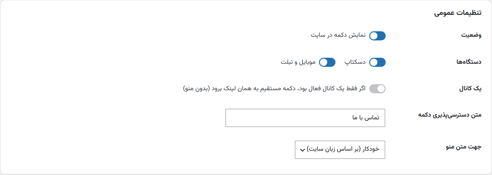

در بخش **نمایش در صفحات** یکی از سه حالت را انتخاب کنید. در حالت‌های «فقط صفحات انتخاب‌شده» و «همه به جز...»، صفحه اصلی، برگه‌ها (با جستجو) و شناسه نوشته‌ها/محصولات را مشخص کنید:

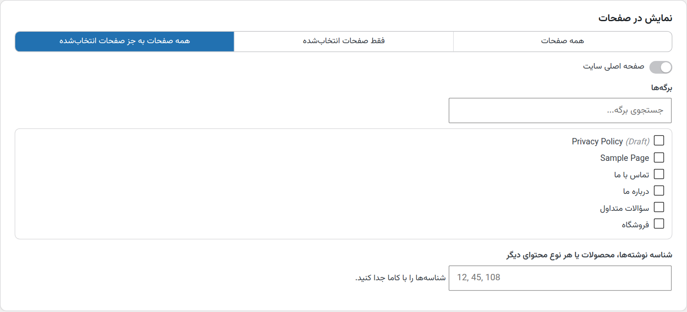

> شناسه هر نوشته یا محصول را در آدرس صفحه ویرایش آن (`post=123`) می‌بینید.

در پایان روی **ذخیره تنظیمات** کلیک کنید.

---

## ساخت لینک کانال‌ها

| نوع | مقدار نمونه | لینک ساخته‌شده |
|---|---|---|
| تماس تلفنی | `+989121234567` | `tel:+989121234567` |
| واتساپ | `989121234567` | `https://wa.me/989121234567?text=...` |
| تلگرام | `username` | `https://t.me/username` |
| اینستاگرام | `username` | `https://instagram.com/username` |
| ایمیل | `info@example.com` | `mailto:info@example.com?subject=...` |
| پیامک | `+989121234567` | `sms:+989121234567?body=...` |
| ایتا / بله / روبیکا | `username` | `eitaa.com/…` / `ble.ir/…` / `rubika.ir/…` |
| لینک دلخواه / نقشه / لینکدین | لینک کامل | همان لینک |

اگر در هر نوعی لینک کامل (مثل `https://...` یا `tg://...`) وارد کنید، همان استفاده می‌شود.

## برای توسعه‌دهندگان

فیلترهای در دسترس:

| فیلتر | کاربرد |
|---|---|
| `fcb_should_display` | تصمیم نهایی نمایش دکمه `( bool $show, array $settings )` |
| `fcb_channels` | تغییر لیست کانال‌های نهایی `( array $channels, array $settings )` |
| `fcb_channel_url` | تغییر لینک یک کانال `( string $url, array $channel )` |
| `fcb_channel_types` | افزودن نوع کانال جدید |
| `fcb_icons` | افزودن آیکون آماده جدید (`label` و `path` در viewBox ‏24×24) |

نمونه: مخفی کردن دکمه در صفحه سبد خرید ووکامرس

```php
add_filter( 'fcb_should_display', function ( $show ) {
	return ( function_exists( 'is_cart' ) && is_cart() ) ? false : $show;
} );
```

## ساختار فایل‌ها

```
floating-call-button.php      فایل اصلی افزونه
uninstall.php                 حذف تنظیمات هنگام پاک کردن افزونه
includes/
  icons.php                   آیکون‌های آماده و پاک‌سازی SVG
  class-fcb-options.php       تنظیمات پیش‌فرض، انواع کانال و پاک‌سازی ورودی
  class-fcb-frontend.php      نمایش دکمه در سایت
  class-fcb-admin.php         صفحه تنظیمات در پیشخوان
assets/css, assets/js         استایل و اسکریپت سایت و پیشخوان
```

## نیازمندی‌ها

- وردپرس ۵.۶ یا بالاتر
- PHP ‏۷.۲ یا بالاتر

## مجوز

GPLv2 or later

---

طراحی شده توسط [مهدی حبیبی | طاووس وب](https://tavoosweb.ir/)

</div>
